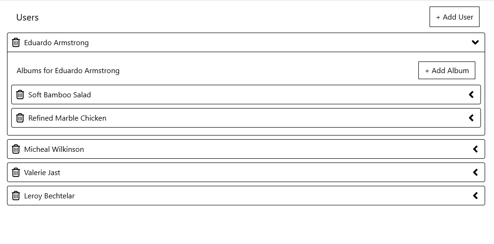
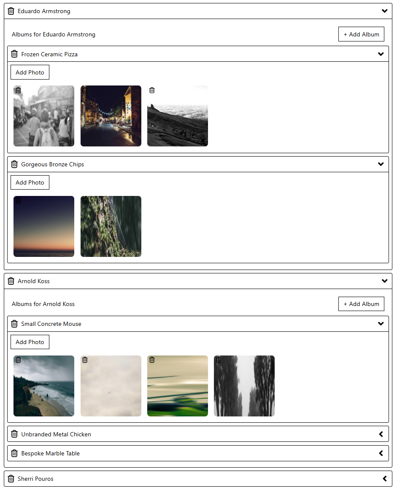

# 🎵 AlbumGenerator

AlbumGenerator is a dynamic React app built with **Redux Toolkit Query** and **json-server** that simulates a mock database of users, albums, and photos. It showcases advanced state management with RTK Query, dynamic UI components, and mock data generation with Faker.js.

---

## 🚀 Features

- 📁 **Users, Albums, and Photos** management
- ➕ Add random users, albums, and photos using Faker
- ❌ Delete users, albums, and photos with instant UI feedback
- 📦 State managed using Redux Toolkit and RTK Query
- 🎨 Clean and responsive UI with utility-first styling
- 🔃 API calls handled automatically with caching, loading, and error states

---

## 🧱 Tech Stack

- **React**
- **Redux Toolkit Query**
- **json-server** (for mock backend)
- **Faker.js** (for generating fake user and album data)
- **Tailwind CSS** or your preferred styling system
- **Vite** (for blazing fast development)

---

## 📁 Project Structure

```
src/
├── components/             # UI Components
│   ├── AlbumList.jsx
│   ├── Button.jsx
│   ├── ExpandablePanel.jsx
│   ├── Panel.jsx
│   ├── PhotoList.jsx
│   ├── PhotoListItem.jsx
│   ├── Skeleton.jsx
│   ├── UsersList.jsx
│   └── UsersListItem.jsx
│
├── store/                  # Redux Store & APIs
│   ├── apis/
│   │   ├── albumsApi.jsx
│   │   ├── photoApi.jsx
│   │   └── usersApi.jsx
│   ├── slices/
│   │   └── usersSlice.jsx
│   └── index.jsx
│
├── App.jsx
├── main.jsx
└── index.css
```

---

## ⚙️ Setup Instructions

### 1. Clone the Repo
```bash
git clone https://github.com/your-username/albumgenerator.git
cd albumgenerator
```

### 2. Install Dependencies
```bash
npm install
```

### 3. Start the Mock API Server
```bash
npm run start:server
```

This runs `json-server` on [http://localhost:3005](http://localhost:3005) and watches `db.json`.

### 4. Start the React App
```bash
npm run dev
```

The frontend runs on [http://localhost:5173](http://localhost:5173) (Vite default).

---

## 🧪 API Endpoints (via json-server)

- `GET /users` - Fetch all users
- `POST /users` - Add a new user
- `DELETE /users/:id` - Remove a user
- `GET /albums?userId=1` - Get albums for a user
- `POST /albums` - Add an album
- `DELETE /albums/:id` - Remove an album
- `GET /photos?albumId=1` - Get photos for an album
- `POST /photos` - Add a photo
- `DELETE /photos/:id` - Remove a photo

---

## ✨ Todo / Improvements

- Add loading indicators for photos and albums
- Create a "view album" page or modal
- Add search/filter functionality
- Persist mock data between sessions
- Add animations with Framer Motion or CSS transitions

---

## 📸 Screenshots (optional)
 - Landing Page

 - Albums

 - Users - Albums - Images



